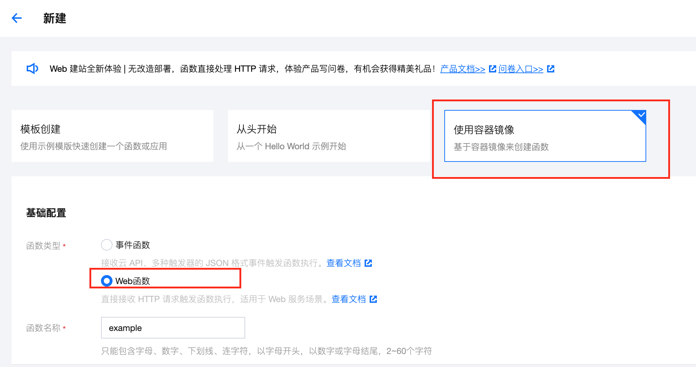
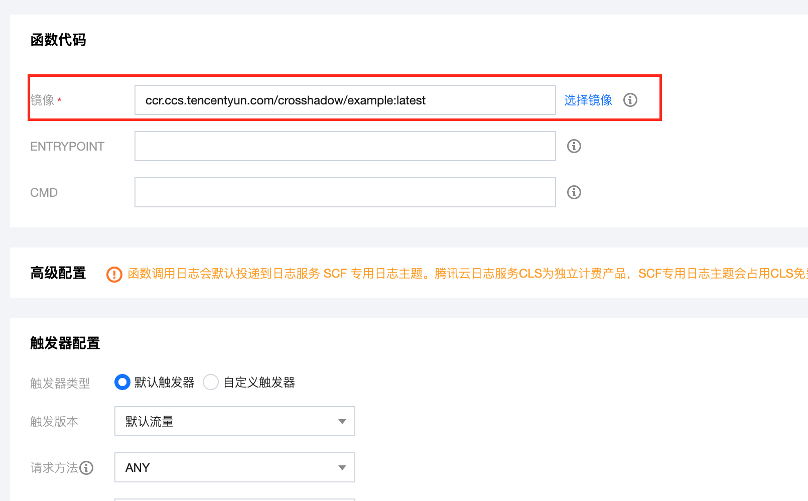

# 腾讯云函数 Docker 镜像部署 Laravel 示例

腾讯云函数提供了模板部署 Laravel 的方式，不过提供的模板中 PHP 和 Laravel 的版本都比较低，且更新代码只能通过上传本地文件夹的方式，不方便。镜像部署会方便很多，期间有些坑比较烦，所以建一个示例项目以供参考。

## 如何使用

1. 拉取此项目，进入项目目录运行 
   1. `cp .env.example .env`
   2. `php artisan key:gen`
2. build 镜像并推送到腾讯云，参考 https://cloud.tencent.com/document/product/1141/63910
3. 使用镜像新建云函数
   1. 
   2. 
   3. 其他选项可以保持默认值，点击完成

## 由于腾讯云函数环境只有 /tmp 目录可写，需要对 Laravel 做出一些修改

1. bootstrap/app.php, 设置 storage path
2. config/logging.php
3. .env 设置 cache path, session driver, cache driver

```
APP_STORAGE=/tmp
APP_SERVICES_CACHE=/tmp/services.php
APP_PACKAGES_CACHE=/tmp/packages.php
APP_CONFIG_CACHE=/tmp/config.php
APP_ROUTES_CACHE=/tmp/routes.php
APP_EVENTS_CACHE=/tmp/events.php
VIEW_COMPILED_PATH=/tmp
SESSION_DRIVER=array
CACHE_DRIVER=array
   ```
